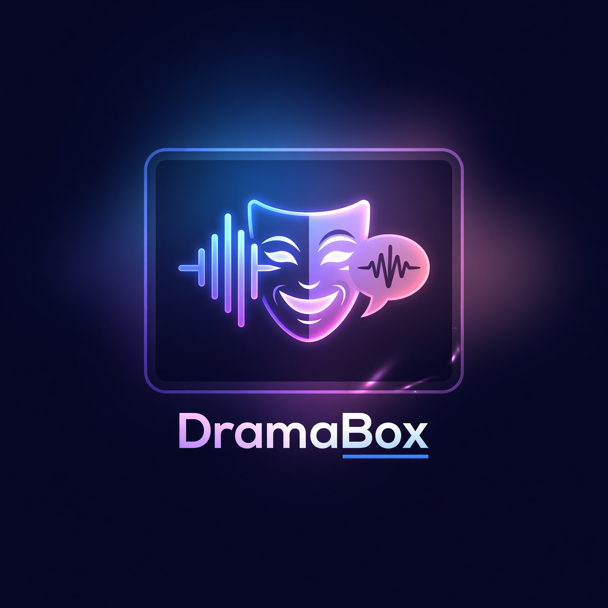

<p align="center">
  
</p>

# DramaBox — Pinokio Launcher

A 1-click Pinokio launcher for [DramaBox](https://github.com/resemble-ai/DramaBox) by Resemble AI — expressive TTS with voice cloning, built on LTX-2.3.

## What It Does

DramaBox is a prompt-driven text-to-speech model with voice cloning. The prompt controls speaker identity, emotion, delivery style, laughs, sighs, pauses and transitions. An optional 10-second voice reference clones the target timbre. It is an IC-LoRA fine-tune of the LTX-2.3 3.3B audio-only model.

**Requirements:** ~24 GB VRAM (NVIDIA GPU), ~17 GB disk space for models.

## How to Use

1. Click **Install** to clone the repo and install all dependencies.
2. Click **Start** to launch the Gradio web UI.
3. Click **Open Web UI** to open DramaBox in your browser.

### Low VRAM Mode

Click **Start Low VRAM** to try the experimental MMGP offload wrapper. This keeps the upstream DramaBox code in `/app` untouched and launches through `launch_low_vram.py`, which auto-selects an MMGP profile from detected CUDA VRAM after the original DramaBox server loads its components. It may reduce VRAM pressure at the cost of speed and higher system RAM usage.

### Prompt Writing Guide

**Structure:** `<speaker description>, "<dialogue>" <action direction> "<more dialogue>"`

**Inside quotes** (model produces actual sounds):
- Laughs: `"Hahaha"` `"Hehehe"`
- Sounds: `"Mmmmm"` `"Ugh"` `"Argh"` `"Ahhh"` `"Hmm"`

**Outside quotes** (stage directions):
- `She sighs deeply.` · `He gulps nervously.` · `A long pause.`

**Example prompt:**
```
A woman speaks warmly, "Hello, how are you today?" She laughs, "Hahaha, it is so good to see you!"
```

## API

### Python

```python
from src.inference_server import TTSServer

server = TTSServer(device="cuda")
server.generate_to_file(
    prompt='A woman speaks warmly, "Hello, how are you today?"',
    output="output.wav",
    voice_ref="reference.wav",   # optional, 10+ seconds
)
```

### CLI

```bash
python src/inference.py \
  --voice-sample reference.wav \
  --prompt 'A woman speaks warmly, "Hello, how are you today?"' \
  --output output.wav \
  --cfg-scale 2.5 --stg-scale 1.5
```

### JavaScript

```javascript
import { Client } from "@gradio/client";

const client = await Client.connect("http://127.0.0.1:7860");
const result = await client.predict("/generate", {
  prompt: 'A woman speaks warmly, "Hello, how are you today?"'
});

console.log(result);
```

### Python Gradio Client

Once the server is running, use the URL from **Open Web UI** with the Gradio API:

```python
from gradio_client import Client

client = Client("http://127.0.0.1:7860")
result = client.predict(
    prompt='A woman speaks warmly, "Hello, how are you today?"',
    api_name="/generate"
)
```

### Curl

```bash
curl -X POST http://127.0.0.1:7860/api/predict \
  -H "Content-Type: application/json" \
  -d '{"data": ["A woman speaks warmly, \"Hello, how are you today?\""]}'
```

## Models

Auto-downloaded on first run from [ResembleAI/Dramabox](https://huggingface.co/ResembleAI/Dramabox):

| File | Size | Description |
|------|------|-------------|
| dramabox-dit-v1.safetensors | 6.6 GB | DiT transformer |
| dramabox-audio-components.safetensors | 1.9 GB | Audio embeddings + VAE + vocoder |
| gemma-3-12b-it-bnb-4bit | ~8 GB | Text encoder |

## License

DramaBox is distributed under the [LTX-2 Community License](https://github.com/resemble-ai/DramaBox/blob/master/LICENSE). Built on [Lightricks/LTX-2.3](https://huggingface.co/Lightricks/LTX-2.3).
